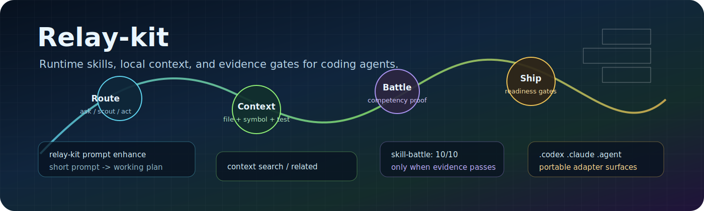

# Relay-kit Docs Site

Relay-kit is a portable runtime skill system for coding agents: route the request, pull local context, apply the right skill, and prove the result before calling work done.

## Start Here

- [Install](install.md)
- [Skill catalog](skill-catalog.md)
- [Local context graph](context-graph.md)
- [Prompt enhancement](prompt-enhance.md)
- [Battle benchmark](battle-benchmark.md)
- [Readiness](readiness.md)

## Public Story

| Pillar | What to inspect |
| --- | --- |
| Routing | `workflow-router`, `repo-map`, prompt enhancement, ask / scout / act decisions |
| Context | local graph index, SQLite FTS, file-symbol-test adjacency, active context |
| Skill depth | competency catalog, good/bad examples, evals, battle cases |
| Governance | adapter generation, manifest trust, policy guard, runtime doctor, readiness |

Specialized extension packs are cataloged for completeness, but the front-door value is the core runtime: portable skill routing, local context, adapter parity, and evidence gates.
